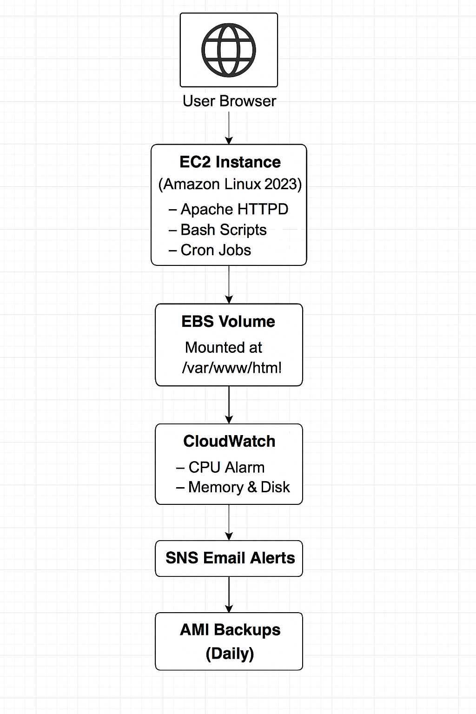
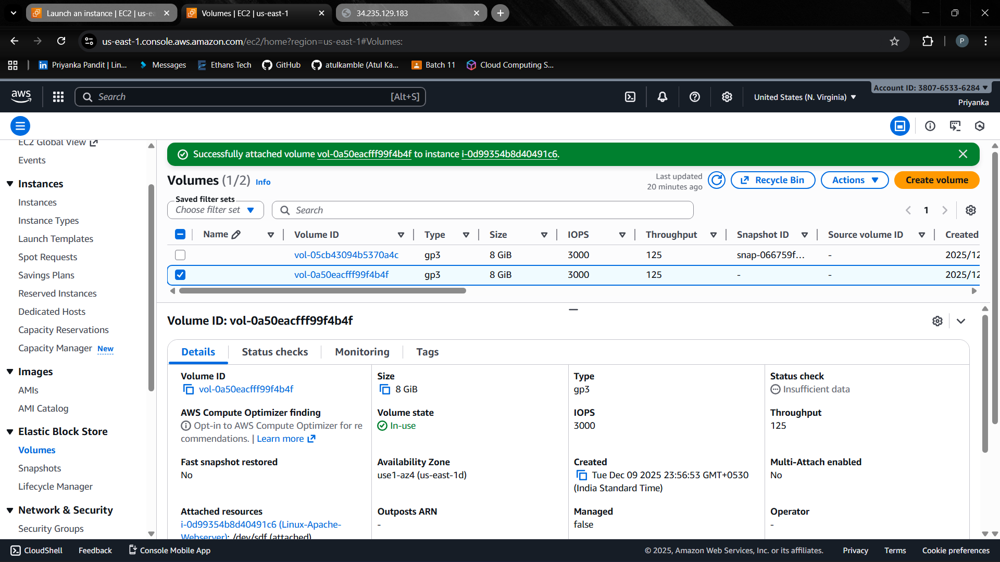

# ec2-ebs-cloudwatch-project
# AWS Linux + Apache Web Server Deployment 

This project demonstrates a complete end-to-end deployment of a Linux-based Apache web server on AWS using EC2, EBS, CloudWatch, Python scripting, and automation.

It is designed to match real job requirements for roles involving:
- Linux Administration
- AWS Infrastructure (EC2, EBS, IAM, CloudWatch)
- Monitoring & Backups
- Python & Automation

---

# 🚀 Project Architecture



---

# ✅ Features Implemented

### **1. EC2 Deployment**
- Launched Amazon Linux 2023 EC2 instance  
- Installed & configured Apache HTTP server  
- Hosted a sample webpage  

### **2. EBS Volume Configuration**
- Created an 8GB EBS volume  
- Formatted with EXT4  
- Mounted to `/mnt/webdata`  
- Bind-mounted to `/var/www/html`  
- Persistent mount using `/etc/fstab`

### **3. Monitoring with CloudWatch**
- Created CPUUtilization Alarm  
- SNS email notifications enabled  
- Installed CloudWatch Agent to collect:
  - Memory usage  
  - Disk usage  
  - Disk I/O metrics  

### **4. Automation with Python Scripts**
#### Maintenance Script:
Automatically updates system packages and restarts Apache.

```
scripts/maintain-webserver.sh
```

#### Backup Script:
Creates daily AMI backups of the EC2 instance.

```
scripts/daily-backup.sh
```

Crontab entries added for automation.

### **5. Backups**
- Automated AMI creation  
- Tagged backups for better visibility  

---

# 📁 Project Structure

```
aws-linux-webserver-project/
│
├── scripts/
│   ├── maintain-webserver.py
│   └── daily-backup.py
│
├── screenshots/
│   ├── cloudwatch-cpu-alarm.png
│   ├── ec2-instance.png
│   ├── ebs-volume.png
│   ├── mount-status.png
│   ├── website-running.png
│   └── backup-ami.png
│
├── architecture/
│   └── architecture-diagram.png
│
└── README.md
```

---

# 🖼 Screenshots

### **EC2 Instance Running**


### **Attached EBS Volume**


### **Mount Confirmation**


### **CloudWatch CPU Alarm**


### **Automated AMI Backups**


### **Apache Web Page**


---

# 🛠 Technologies Used
- Amazon EC2  
- Amazon EBS  
- Amazon CloudWatch  
- Amazon SNS  
- Python Scripting  
- Linux (Amazon Linux 2023)  
- Apache HTTP Server  

---

# 🧠 What I Learned
- How to deploy and configure a production-like EC2 web server  
- How to attach, format, and mount EBS volumes  
- How to automate backups using AMIs  
- Creating CloudWatch alarms and monitoring metrics  
- Writing Python scripts for server maintenance  
- Managing services using systemctl  

---

# 📌 How to Reproduce This Project
1. Create an EC2 instance (Amazon Linux 2023)  
2. Install Apache  
3. Create and attach an EBS volume  
4. Format & mount it to `/var/www/html`  
5. Install CloudWatch agent and create CPU alarm  
6. Add automation scripts and schedule cron jobs  
